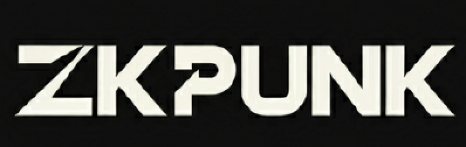

  

ZKPunk 是一个以社区为核心的零知识证明（zk）组织，致ZKP z力于推动 zk 技术的普及与发展。我们专注于整合 zk 相关的资源，并通过创建高质量的学习内容与工具，帮助全球开发者更好地理解和应用 zk 技术。

## 🚀 我们的愿景是：
构建一个更好、更容易访问、更广泛的 zkp 教程系列作为公共产品。
通过提供高质量、易于获取的 zk 教程与资源，我们希望促进 zk 技术的广泛应用，推动整个 zk 生态系统的进一步发展。

## 我们正在进行的项目

### 📔 ZKPunk 知识平台
 [zkpunk.pro/ZKPedia](https://zkpunk.pro/ZKPedia/)  致力于汇聚并开源全球分散的 zk 相关资料，整理成结构化的内容，方便社区成员随时访问并学习。

### 💡 zk insight 周报
 [zk insight](https://insights.zkpunk.pro) 每周定期发布，涵盖 zk 领域的最新技术进展、学术论文和项目更新，帮助社区保持对 zk 行业发展的前沿洞察。

### 🏖️ zkp-academy

我们正在进行一系列面向各类学习者的课程，包括理论和代码不同方面，帮助开发者全面掌握 zk 技术。

[Plonk course](https://github.com/Antalpha-Labs/zkp-academy/tree/main/Plonk)

[FRI & Stark course](https://github.com/Antalpha-Labs/zkp-academy/tree/main/FRI%26Stark)

### 🔥 Contributors

  <h4 align="center">
    Thank you for all your contributions!!
  </h4>
  

